# SCP - Containment Breach Ultimate Edition Reborn On Linux/SteamDeck

## Important Note: Please Report any Issues with the setup guide not listed in the common issues section directly to Me Not the UER Mod Devs. Only Report In-Game Bugs/Issues To The UER Devs.

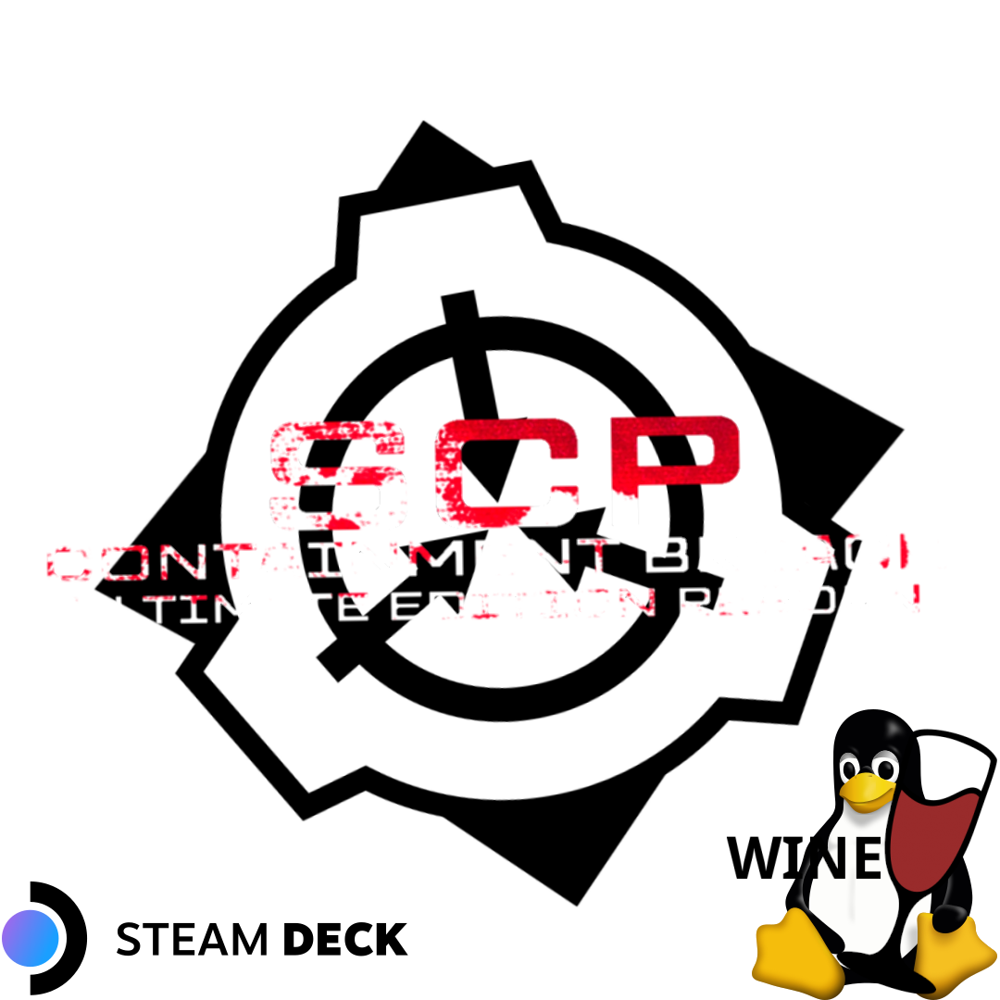

**Step 1**

Install Lutris and follow the instructions on their website for the device/distro you use, then download the installer for SCP CB UER Mod.

- **Lutris**: (*https://lutris.net/downloads*)

- **SCP Ultimate Edition Reborn Installer**: (*https://www.moddb.com/mods/scp-containment-breach-ultimate-edition/downloads/scp-containment-breach-ultimate-edition-reborn-setup*)

**Step 2**

**Open Lutris**:

Go to the top left corner and **Click The Plus Symbol**, then a menu looking like this will pop up

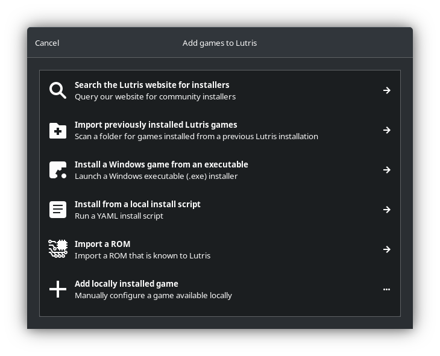

Click the third option: "**Install a Windows game from an executable**"

Then a third menu will pop up asking you to name the game, **Name It Anything You Want**

After you named the game, **Click Install**

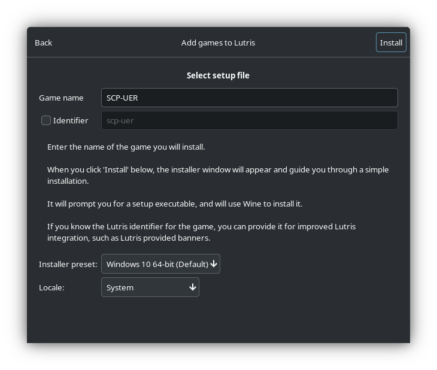

After clicking install another menu will pop up showing you **The Installation Directory.**  **This is Important For Step 3, Make Sure You Remember Where the Directory/Folder Is.** 

Hit Continue:

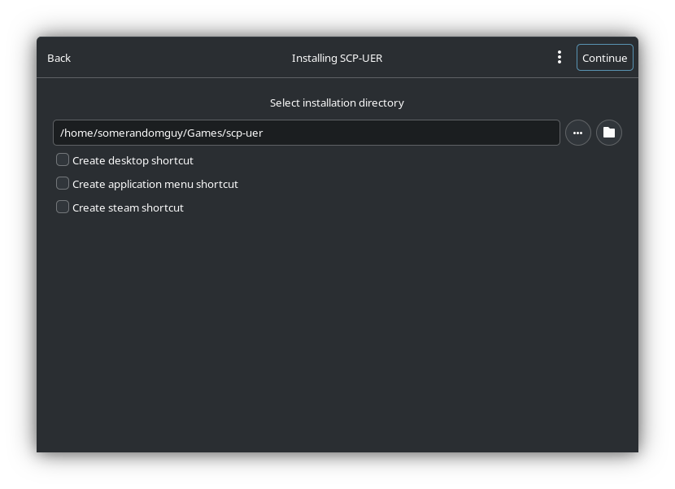

Then another menu will pop asking you to **Select The Setup File, Hit The 3 Dots And Navigate To The Directory Where The Installer Is And Select It, Hit Ok, And Hit Install**

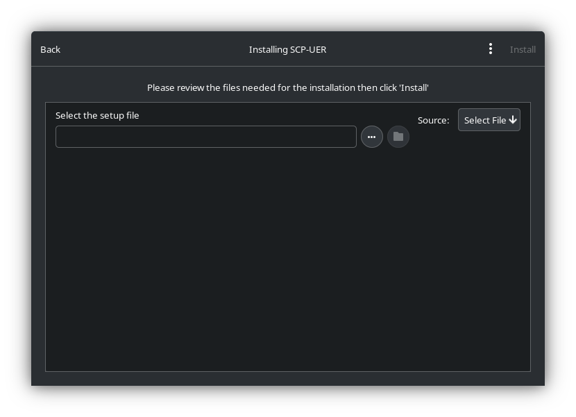

After Going through the setup **Launch The Game So It Will Generate An Options.ini file needed for Step 3**

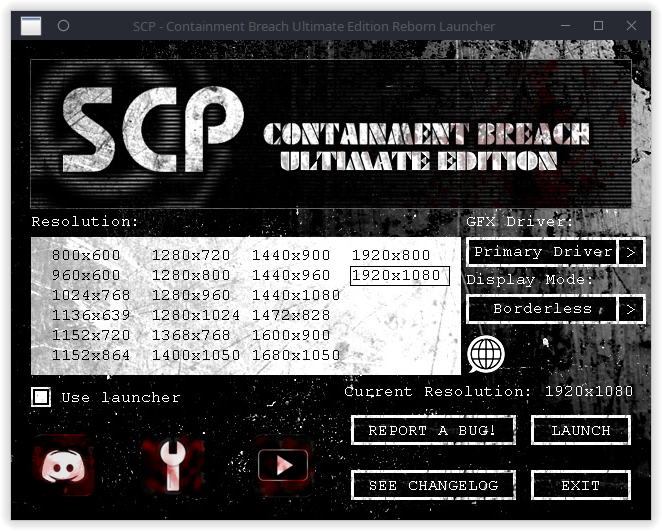

After Launching the game **you will get a Memory Access Violation, Dont Worry This Will Disapper after Step 3.**

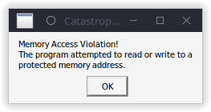

**Close The Game and Go Back to Lutris**

After going back to lutris, **Select the Game and Hit the Up Arrow next to Play and Select Configure.**

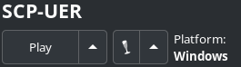

After selecting configure a menu will pop with options to configure the game, Go to Game Options and **Click the Three Dots and Select the Game Executable then Hit Ok so *Common Issue 1* wont happen.**

**Step 3**

**Navigate to the directory where the Game/Wine prefix is**. It will look like this:

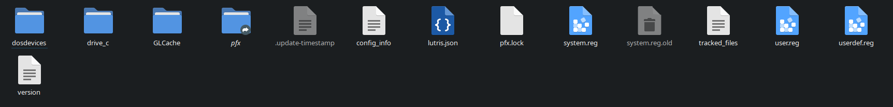

**Navigate and go through the following Directories/Folders:** *drive_c/users/"yourusername"/AppData/Roaming/scpcb-ue/Data*

After Getting to the directory/folder location, there will be a file called *Options.ini* 

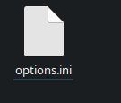

**Download The Pre-Configured Ini File from here in my repo and overwrite it with the on in the Data Folder** (*https://github.com/MrBonely/SCP-UER-Linux-SteamDeck-Setuo/blob/main/ini/options.ini*)

Also open up the ini file and make sure it looks like this:

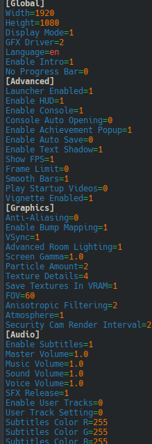

After Checking that, **Go Back to Lutris** and press play an it should start with no Memory Access Violation

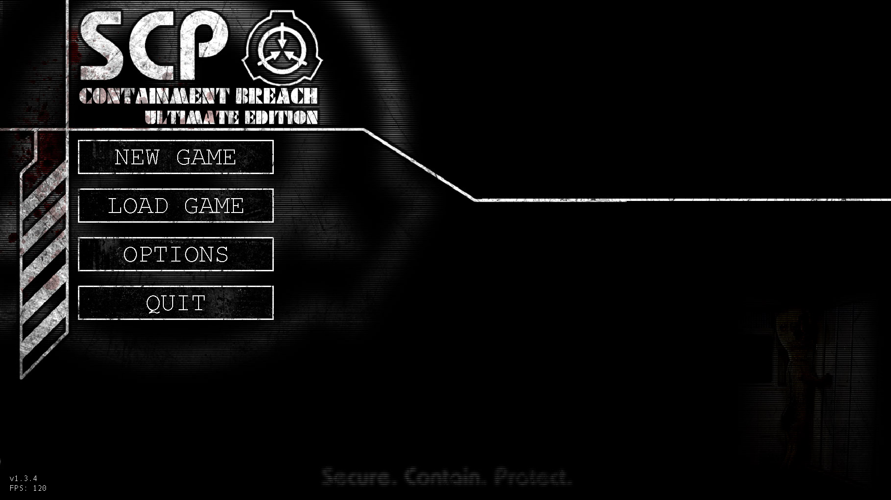

# Common Issues:

### 1. "Rmesh to load:"

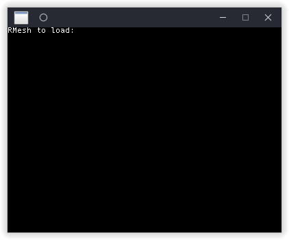

**Fix:** Select the Game and Hit the Up Arrow next to Play and Select Configure, Go to Game Options and select the 3 dots then select the game executable and hit ok and close then the game should launch now.

**What Caused It?:** when you install a game on lutris it will automatically select the executable in the game directory. if there is multiple executables it will pick the first one A-Z so it picked Rmesh Viewer instead of the game executable